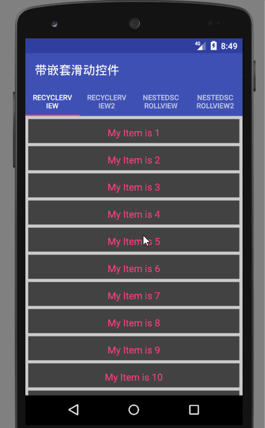
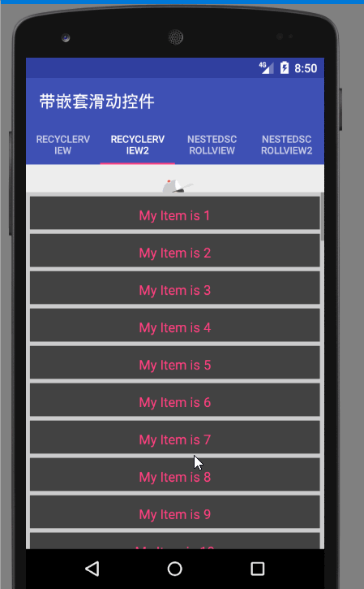
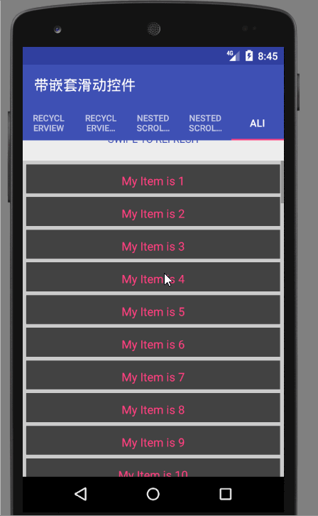
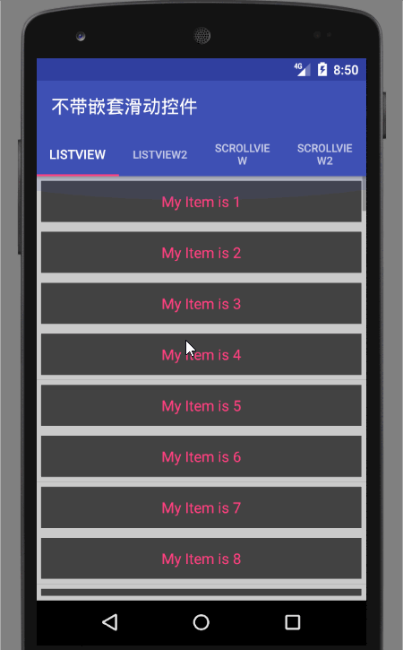
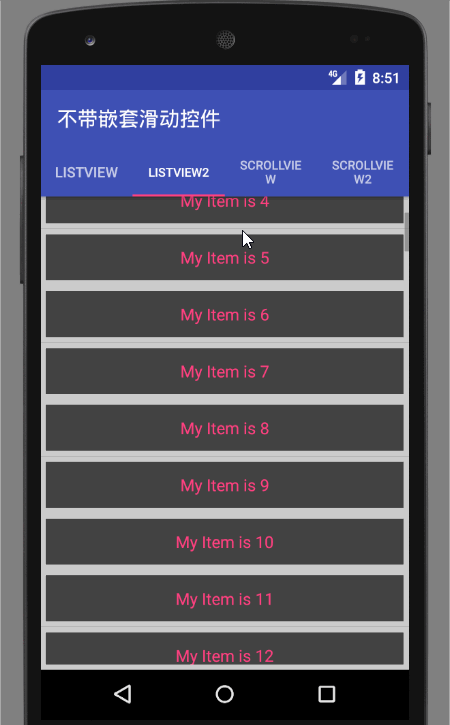

# NestedRefreshLoadMore
### 下拉刷新，上拉加载，完美支持嵌套滑动。

### 看到标题介绍后，可能有些朋友要问我网上那么多下拉刷新上拉加载的项目，你为什么还要写一个？
### 我写这个的目的是网上的项目基本上很少能够完美兼容嵌套滑动，体验不好，加上和CoordinatorLayout和AppBarLayout等控件的嵌套使用时有bug出现，所以我自己就写了这个项目。

 

### 主要介绍我自己写的一个下拉刷新上拉加载控件NestedRefreshLoadMoreLayout，以及如何使用：

### NestedRefreshLoadMoreLayout的优势：
>### 1.灵活定制刷新，加载的样式，以及动画
>### 2.灵活切换刷新，加载的模式：跟随还是重叠
>### 3.灵活设置拉动的最大距离，触发偏移量等等
>### 4.完美兼容嵌套滑动，比如NestedScroll，和CoordinatorLayout和AppBarLayout等控件的嵌套使用。
>### 5.支持NestedScrollView，RecyclerView,ScrollView,ListView,GridView的刷新和加载。

 

### 效果：

 

 

### 使用：

### (1).项目引入

	compile 'github.skcodestack:nestedrefreshloadmore:1.2.1'

### (2).编写xml

	<github.skcodestack.nestedrefresh.NestedRefreshLoadMoreLayout
        android:id="@+id/lay_refresh"
        android:layout_width="match_parent"
        android:layout_heisxght="match_parent"
        app:header="@layout/layout_default_header"
        app:footer="@layout/layout_default_footer"
        app:mode="follow"
        >
        <android.support.v7.widget.RecyclerView
            android:id="@+id/recyclerView"
            android:layout_width="match_parent"
            android:layout_height="match_parent"
            android:paddingBottom="5dp"
            android:scrollbars="vertical"
            android:background="#cccccc"/>

    </github.skcodestack.nestedrefresh.NestedRefreshLoadMoreLayout>

### (3).编写代码

	refreshView.setOnRefreshListener(this);
	refreshView.setOnLoadMoreListener(this);

 

------------------------------------------------------------------------------------------------------

## 其他设置：

### 1.开关刷新和加载：
	
	refreshView.setRefreshEnabled(true);
	refreshView.setLoadMoreEnabled(true);

### 2.设置模式

>### (1).代码设置：
>

	refreshView.setMode(NestedRefreshLoadMoreLayout.Mode.FOLLOW);
  
>
>### (2).xml设置：
>
	app:mode="follow"
>

### 3.头布局和尾布局设置：

>### (1).代码设置：

>
	refreshView.setRefreshHeaderView(view);
	refreshView.setLoadMoreFooterView(view);
>

>### (2).xml设置：
>
	app:header="@layout/layout_default_header"
	app:footer="@layout/layout_default_footer"
>

### 4.开关刷新与加载：

>### true:开启  flase:关闭

>
	refreshView.setRefreshing(true);
	refreshView.setLoadingMore(true);
>

### 5.设置刷新和加载监听

>
	refreshView.setOnRefreshListener(this);
	refreshView.setOnLoadMoreListener(this);
>

### 6.定制刷新布局

>### 头布局需要继承BaseHeader,比如：DefaultOnRefreshHeaderView

>### 可以重写的方法：

>
 
	//开始滑动调用
	@Override
	public void onPrepare() {}
	//滑动过程中调用
	//dy ---滑动偏移量
	//offset---触发刷新的偏移量
	@Override
	public void onDrag(int dy,int offset) {}
	//手释放时调用
	@Override
	public void onRelease() {}
	//滑动结束调用
	@Override
	public void onComplete() {}
	//重置时调用
	@Override
	public void onReset() {}
	//返回最大滑动距离
	@Override
	public int getDragMaxOffset(View rootView, View target, int targetHeight) {
		return 0;
	}
	//返回触发刷新位移
	@Override
	public int getDragTriggerOffset(View rootView, View target, int targetHeight) {
		return 0;
	}
	//刷新加载时de高度
	@Override
	public int getRefreshOrLoadMoreHeight(View rootView, View target, int targetHeight) {
	return 0;
	}
	//刷新时调用
	@Override
	public void onRefresh() {}
>
>
>

### 6.定制加载布局

>### 头布局需要继承BaseFooter,比如：DefaultOnLoadMoreFooterView

>### 可以重写的方法：	

>
	//开始滑动调用
	@Override
	public void onPrepare() {}
	//滑动过程中调用
	//dy ---滑动偏移量
	//offset---触发加载的偏移量
	@Override
	public void onDrag(int dy,int offset) {}
	//手释放时调用
	@Override
	public void onRelease() {}
	//滑动结束调用
	@Override
	public void onComplete() {}
	//重置时调用
	@Override
	public void onReset() {}
	//返回最大滑动距离
	@Override
	public int getDragMaxOffset(View rootView, View target, int targetHeight) {
		return 0;
	}
	//返回触发加载位移
	@Override
	public int getDragTriggerOffset(View rootView, View target, int targetHeight) {
		return 0;
	}
	//刷新加载时de高度
	@Override
	public int getRefreshOrLoadMoreHeight(View rootView, View target, int targetHeight) {
	return 0;
	}
	//加载时调用
	@Override
	public void onLoadMore() {
	}
>

 

 

 

## 版本

#### 1.2.1   （1）.解决1.1.1版本中在嵌套滑动情况下，会出现回弹的情况 . （2）.添加了刷新和加载时头部和尾部的高度，可以实现很多炫酷的效果

	     	
#### 1.1.1   解决1.1.0版本中在非嵌套滑动情况下，快速滑动回弹中有一丝卡顿

#### 1.1.0   添加了默认的刷新和加载布局

 

 

## Thinks :

   ####   - [Google SwipeRefreshLayout](###)
   ####   - [Google RecyclerView](###)
   ####   - [SwipeToLoadLayout](https://github.com/Aspsine/SwipeToLoadLayout)

 

 

## Contact Me

   ####   Github: github.com/skcodestack
   ####   Email:  skcodestack@outlook.com
   ####   QQ:     1562363326

 

 

## License

	Copyright 2015 Aspsine. All rights reserved.

	Licensed under the Apache License, Version 2.0 (the "License");
	you may not use this file except in compliance with the License.
	You may obtain a copy of the License at

	    http://www.apache.org/licenses/LICENSE-2.0

	Unless required by applicable law or agreed to in writing, software
	distributed under the License is distributed on an "AS IS" BASIS,
	WITHOUT WARRANTIES OR CONDITIONS OF ANY KIND, either express or implied.
	See the License for the specific language governing permissions and
	limitations under the License.

